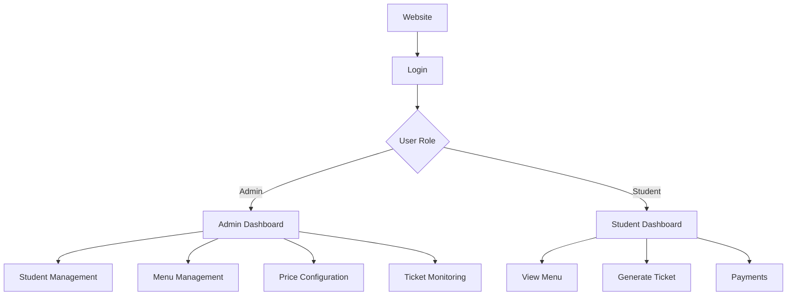

# Canteen Management

## Overview

- **Real-world problem:** Schools often run a canteen with rotating menus, different meal prices (e.g. lunch vs snack), and many students booking or paying separately. Tracking who ordered what, which day, and whether they paid is easy to mishandle on paper or in ad hoc spreadsheets.
- **What this system does:** It gives **admins** a single place to maintain students, build or auto-generate **weekly menus** (Mon–Sat), set **prices over time**, and see **tickets** linked to students. **Students** log in, browse the menu, **generate tickets** for specific days and types, then **pay** for selected unpaid tickets (payment is simulated in code).

## Demo

[Add demo video link here]

## Features

### Admin features

- Log in with admin credentials (session-based).
- **Student management:** list, add, update, delete students; view a student’s profile.
- **Menu management:** view weekly menu; create or edit a day’s menu from item pools; auto-generate a week of random menus when days are empty.
- **Price configuration:** set prices by meal type (e.g. LUNCH, SNACK); view current values and recent history.
- **Ticket monitoring:** view ticket list with student names (from meal tickets + joins).

### Student features

- Log in with student credentials (session-based).
- **View menu** for the current or chosen week (Mon–Sat grid).
- **Generate meal tickets** for a chosen day and ticket type (blocked if a ticket of that type already exists for that day).
- **Payments:** see unpaid tickets, select tickets to pay; view paid tickets after payment.
- **Dashboard** with quick links for menu, payments, and tickets.

## Tech stack

| Group | Technologies |
|--------|----------------|
| **Backend** | Java 8, Java Servlets 4.0, JSP, JSTL |
| **Frontend** | JSP, HTML/CSS, JavaScript, Bootstrap 3, jQuery (CDN) |
| **Database** | MySQL 8.x (via JDBC), `mysql-connector-java` |
| **Tools** | Maven (WAR packaging), servlet container with JNDI (e.g. Apache Tomcat) |

## Architecture

This project uses a **classic MVC-style layout** on top of **Java Servlets** (no Spring MVC).

- **Model:** Plain Java classes under `entity` represent rows and concepts (student, menu, ticket, payment, prices). They carry data; they are not JPA entities.
- **View:** JSP pages under `src/main/webapp` render HTML. Controllers **forward** requests to the right JSP with request attributes set.
- **Controller:** Each servlet in `controller` maps to URL patterns in `WEB-INF/web.xml`. Servlets read HTTP parameters, call **services** or **database** helpers, then forward or redirect.

**Supporting layers**

- **Service:** Encapsulates rules (e.g. “one ticket per student per day per type,” payment totals, menu existence checks).
- **Database:** JDBC code against a **`DataSource`** (`jdbc/canteen` in `META-INF/Context.xml`) — SQL lives here, not in JSPs.

### System overview



### UML diagrams

Place exported diagrams under `docs/uml/` and keep paths stable for docs and PRs:

| Diagram | File |
|--------|------|
| Example (replace with your assets) | `docs/uml/use-case.png` |
| Example (replace with your assets) | `docs/uml/class-diagram.png` |
| Example (replace with your assets) | `docs/uml/sequence-payment.png` |


> **Note:** The `docs/uml/` folder and image files are not committed in this template; add your own PNG/SVG files so the links above resolve.

## Project structure

```text
canteen/
├── pom.xml
├── README.md
├── .gitignore
├── .classpath
├── .project
└── src/
    └── main/
        ├── java/
        │   ├── all_code.txt
        │   └── canteen/demo/
        │       ├── controller/
        │       │   ├── LoginController.java
        │       │   ├── LogoutController.java
        │       │   ├── MenuController.java
        │       │   ├── TicketController.java
        │       │   ├── StudentController.java
        │       │   ├── PaymentController.java
        │       │   └── PriceController.java
        │       ├── database/
        │       │   ├── AdminDatabase.java
        │       │   ├── StudentDatabase.java
        │       │   ├── MenuDatabase.java
        │       │   ├── TicketDatabase.java
        │       │   └── PaymentDatabase.java
        │       ├── entity/
        │       │   ├── Student.java
        │       │   ├── Admin.java
        │       │   ├── DailyMenu.java
        │       │   ├── MealTicket.java
        │       │   ├── StudentTicket.java
        │       │   ├── ConfigPrice.java
        │       │   ├── PaymentTransaction.java
        │       │   ├── PaymentDetail.java
        │       │   └── … (menu item types: Snack, Appetizer, etc.)
        │       └── service/
        │           ├── AdminService.java
        │           ├── StudentService.java
        │           ├── MenuService.java
        │           ├── TicketService.java
        │           ├── PaymentService.java
        │           └── PriceService.java
        └── webapp/
            ├── WEB-INF/
            │   ├── web.xml
            │   └── index.html
            ├── META-INF/
            │   ├── MANIFEST.MF
            │   └── Context.xml
            ├── admin/
            │   ├── edit-menu.jsp
            │   ├── manage-students.jsp
            │   ├── student-details.jsp
            │   └── price-config.jsp
            ├── includes/
            │   ├── header.jsp
            │   ├── footer.jsp
            │   ├── menu-grid.jsp
            │   └── menu-modals.jsp
            ├── css/
            │   └── menu-styles.css
            ├── js/
            │   └── menu-functions.js
            ├── index.jsp
            ├── log-in.jsp
            ├── dashboard.jsp
            ├── view-menu.jsp
            ├── view_students.jsp
            ├── studentTickets.jsp
            ├── payment.jsp
            ├── paidticket.jsp
            └── all_guicode.txt
```

Maven output (e.g. `target/`) appears after a build and is omitted above.

## Setup instructions

### Prerequisites

- **JDK 8**
- **Apache Maven** 3.6+
- **MySQL** with a database named **`canteen`** (or adjust URL in `Context.xml`)
- **Servlet container** with JNDI support (e.g. **Apache Tomcat** 9+)
- Tables and seed data matching the SQL used in `database` classes (`students`, `canteen_admin`, `daily_menu`, item tables, `meal_tickets`, `config_prices`, `payment_transactions`, `payment_details`, etc.)

### Run locally (high level)

1. **Clone** the repository and open it in your IDE, or use the CLI from the project root.
2. **Create the MySQL schema** and data your JDBC code expects (derive from `MenuDatabase`, `StudentDatabase`, `PaymentDatabase`, `TicketDatabase`, `AdminDatabase`, `PriceService`).
3. **Edit** `src/main/webapp/META-INF/Context.xml`: set `username`, `password`, and `url` for your MySQL instance.  
   - Default in repo: `jdbc:mysql://localhost:3306/canteen`, user `root`.
4. **Build the WAR:**  
   `mvn clean package`  
   Output: `target/CanteenManagement-1.0-SNAPSHOT.war` (artifact name from `pom.xml`).
5. **Deploy** the WAR to Tomcat (copy to `webapps/` or use your IDE’s Tomcat run configuration). Ensure the app’s `META-INF/Context.xml` is honored so **`jdbc/canteen`** is bound.
6. **Open** the app in a browser:  
   `http://localhost:<port>/CanteenManagement-1.0-SNAPSHOT/`  
   (context path may differ if you rename the WAR or configure a different path.)

## Usage

- **Everyone:** Landing page redirects to **`/login`**. Sign in as admin or student.
- **Admin:** Use the dashboard links to manage students, open the weekly menu (create / edit / generate week), configure prices, and open the student-ticket list.
- **Student:** From the dashboard, open the menu for a week, generate tickets for specific days, go to **My Payments** to select unpaid tickets and submit payment, and **My Tickets** to see paid items.

## Database design

Tables are implied by the JDBC layer (not shipped as SQL migrations in this repo). Main areas:

- **`students`** — student accounts (`student_id`, email, password, name, class).
- **`canteen_admin`** — admin login lookup by email.
- **Menu catalog** — `snacks`, `appetizer`, `vegetables`, `proteins`, `carbohydrates`, `dessert` (IDs and names; proteins include a type column in queries).
- **`daily_menu`** — one row per date with foreign keys to each food category.
- **`meal_tickets`** — student bookings: `student_id`, `daily_menu_id`, `ticket_type`, `ticket_date`, `paid` flag.
- **`config_prices`** — time-stamped rows per `meal_type` and `price` (latest row used as “current” in payment queries).
- **`payment_transactions`** / **`payment_details`** — one payment record and per-ticket line amounts; successful flow marks related `meal_tickets` as paid.

For exact column names and relationships, use the `SELECT` / `INSERT` / `UPDATE` strings in the `database` package as the source of truth when creating or adjusting the schema.
