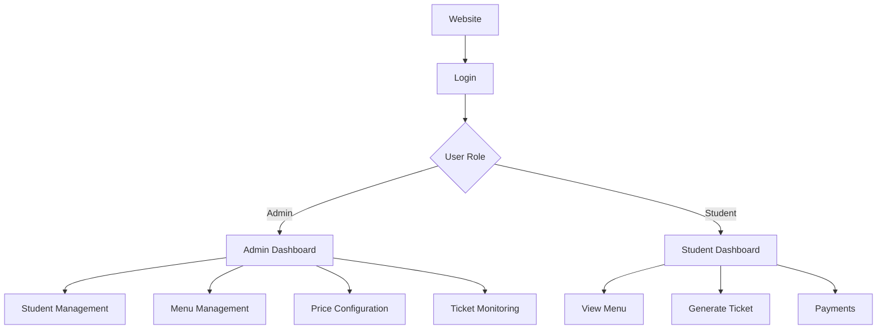
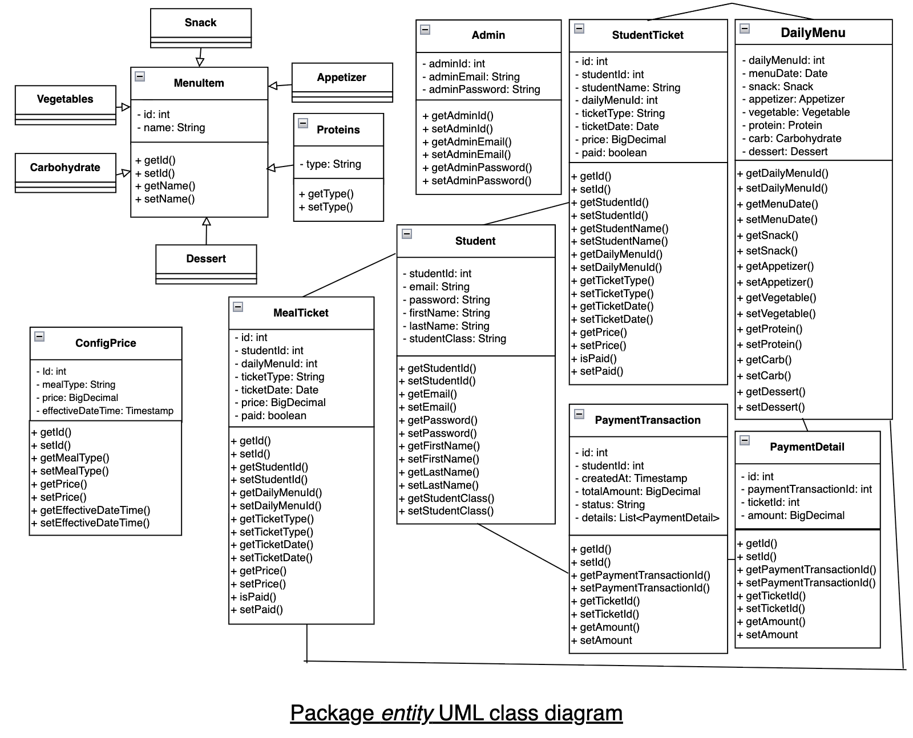
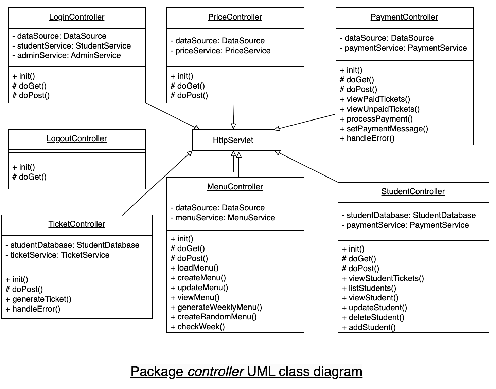
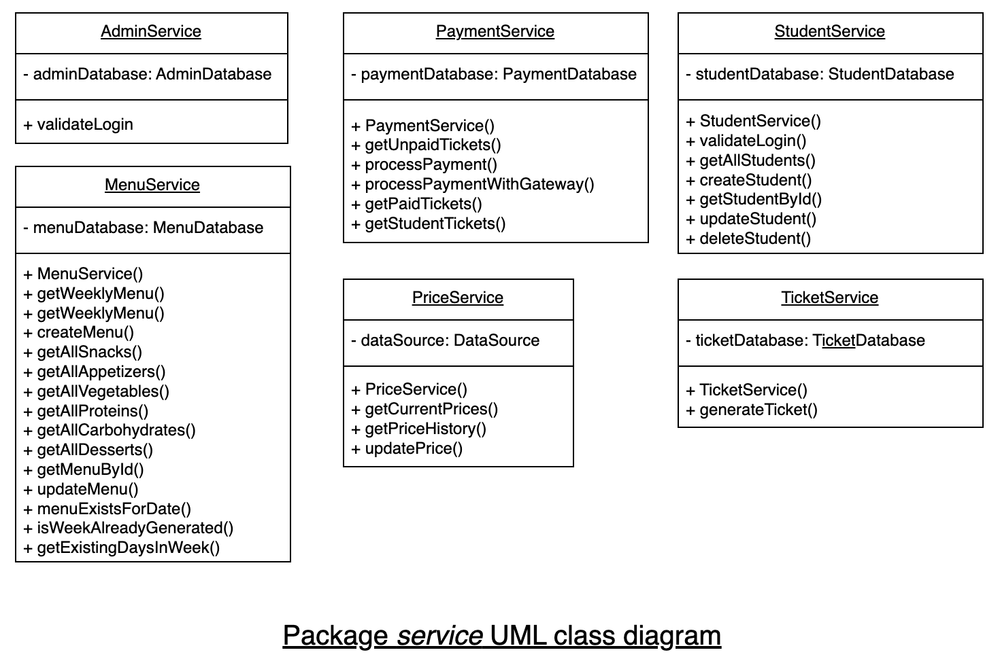

# Canteen Management

## Overview

- **Real-world problem:** School canteens need clear weekly menus, consistent pricing (e.g. lunch vs snack), and a reliable way to know which students booked which meals and whether they paid—without relying on scattered notes or spreadsheets.
- **What this system solves:** **Admins** manage students, build or auto-generate **Monday–Saturday** menus from fixed food categories, configure **time-stamped prices**, and review **meal tickets** with student names. **Students** sign in, browse the menu, **create tickets** for specific days and types, then **pay** for selected unpaid tickets. Payment is simulated in the application logic (no external payment integration).

## Demo

Watch a full walkthrough of the system:
[Demo Video]: https://drive.google.com/file/d/14qDA8ZHMWyDtbJtUnWRO01bgIB0vSOP1/view?usp=sharing

## Features

### Admin features

- Session-based login (validated against `canteen_admin`).
- **Students:** list, add, update, delete; view one student’s details.
- **Menus:** weekly grid; create/update a day’s menu; load a day for edit; **generate a full week** of random menus for empty days only.
- **Prices:** view current prices and recent history for configured meal types (e.g. LUNCH, SNACK); post new price rows.
- **Tickets:** screen listing tickets joined with student names and prices (admin navigation).

### Student features

- Session-based login (validated against `students`).
- **Dashboard** links: weekly menu, unpaid payments, paid tickets.
- **Menu:** view Mon–Sat menu for a selected or default week.
- **Tickets:** submit a ticket for a menu day and type; **one ticket per student per day per type** (enforced in service/DB).
- **Payments:** list unpaid tickets, select multiple, process payment; view paid tickets afterward.

## Tech stack

| Area | Stack |
|------|--------|
| **Backend** | Java 8, Java Servlet API 4.0, JSP, JSTL 1.2 |
| **Frontend** | JSP, HTML/CSS, JavaScript; Bootstrap 3 and jQuery (CDN in JSPs) |
| **Database** | MySQL 8.x, JDBC, `mysql-connector-java` 8.0.27 |
| **Tools** | Maven (WAR build), servlet container with JNDI (e.g. Tomcat) |

## Architecture

The app follows **MVC-style separation** using **servlets**, not a framework like Spring.

- **Model (`entity`):** Java beans for domain data—students, admins, daily menus, food categories, tickets, payments, price config. No ORM; objects map to rows conceptually.
- **View (`webapp` JSPs):** HTML UI. Servlets **forward** with `request` attributes or **redirect** after POST.
- **Controller (`controller`):** `HttpServlet` subclasses mapped in `WEB-INF/web.xml`. They parse parameters, enforce session where coded, call services/databases, then choose the next page.

**Extra layers (not classic “MVC” letters but clear roles):**

- **Service:** Business rules—login checks, ticket uniqueness, payment totals, menu existence/week helpers.
- **Database:** JDBC only—SQL strings, `PreparedStatement`, transactions where implemented (e.g. payments).

### System overview



## UML Diagrams

### Entity Diagram


### Controller Diagram


### Service Diagram


## Project structure

```text
canteen/
├── pom.xml
├── README.md
├── .gitignore
└── src/
    └── main/
        ├── java/
        │   └── canteen/
        │       └── demo/
        │           ├── controller/
        │           │   ├── LoginController.java
        │           │   ├── LogoutController.java
        │           │   ├── MenuController.java
        │           │   ├── TicketController.java
        │           │   ├── StudentController.java
        │           │   ├── PaymentController.java
        │           │   └── PriceController.java
        │           ├── database/
        │           │   ├── AdminDatabase.java
        │           │   ├── StudentDatabase.java
        │           │   ├── MenuDatabase.java
        │           │   ├── TicketDatabase.java
        │           │   └── PaymentDatabase.java
        │           ├── entity/
        │           │   ├── Admin.java
        │           │   ├── Student.java
        │           │   ├── DailyMenu.java
        │           │   ├── MealTicket.java
        │           │   ├── StudentTicket.java
        │           │   ├── ConfigPrice.java
        │           │   ├── PaymentTransaction.java
        │           │   ├── PaymentDetail.java
        │           │   ├── MenuItem.java
        │           │   ├── Snack.java
        │           │   ├── Appetizer.java
        │           │   ├── Vegetable.java
        │           │   ├── Protein.java
        │           │   ├── Carbohydrate.java
        │           │   └── Dessert.java
        │           └── service/
        │               ├── AdminService.java
        │               ├── StudentService.java
        │               ├── MenuService.java
        │               ├── TicketService.java
        │               ├── PaymentService.java
        │               └── PriceService.java
        └── webapp/
            ├── WEB-INF/
            │   ├── web.xml
            │   └── index.html
            ├── META-INF/
            │   ├── MANIFEST.MF
            │   └── Context.xml
            ├── admin/
            │   ├── edit-menu.jsp
            │   ├── manage-students.jsp
            │   ├── student-details.jsp
            │   └── price-config.jsp
            ├── includes/
            │   ├── header.jsp
            │   ├── footer.jsp
            │   ├── menu-grid.jsp
            │   └── menu-modals.jsp
            ├── css/
            │   └── menu-styles.css
            ├── js/
            │   └── menu-functions.js
            ├── index.jsp
            ├── log-in.jsp
            ├── dashboard.jsp
            ├── view-menu.jsp
            ├── view_students.jsp
            ├── studentTickets.jsp
            ├── payment.jsp
            └── paidticket.jsp
```

- **`target/`** appears after `mvn package` (not listed above).
- **`docs/uml/`** is for your diagram assets; it is not in the repo until you add it.

## Setup instructions

### Prerequisites

- JDK **8**
- **Maven** 3.6+
- **MySQL** with a schema matching the SQL in `canteen.demo.database` and `PriceService` (tables such as `students`, `canteen_admin`, `daily_menu`, category tables, `meal_tickets`, `config_prices`, `payment_transactions`, `payment_details`).
- **Tomcat** (or similar) with JNDI **DataSource** support.

### Steps to run locally

1. Clone the repo and open the project root (where `pom.xml` lives).
2. Create the MySQL database and tables; load admin/student/menu seed data as needed.
3. Edit **`src/main/webapp/META-INF/Context.xml`**: set JDBC `url`, `username`, and `password` for your MySQL instance. The JNDI name must stay **`jdbc/canteen`** to match `@Resource` on servlets.
4. Build: `mvn clean package` → WAR at `target/CanteenManagement-1.0-SNAPSHOT.war`.
5. Deploy the WAR to Tomcat; confirm the app context and that **`jdbc/canteen`** resolves.
6. Browse to the deployed context root; **`index.jsp`** redirects to **`/login`**.

## Usage

- **Login:** `POST /login` with email and password. Admins are checked first, then students. Session stores `admin` or `student` and `userType`.
- **Admin:** From **`dashboard.jsp`**, open student list, weekly menu (via JS to `/menu?command=VIEW&weekStart=…`), prices (`/prices`), or all student tickets (`/students?command=VIEW-STUDENT-TICKETS`). Manage menus via `/menu` (GET/POST `command` parameters) and students via `/students`.
- **Student:** Open menu the same way; create tickets via **`POST /ticket`** (`command=GENERATE`); pay via **`/payment`** (view unpaid, post `command=PROCESS` with ticket IDs); view paid list with **`/payment?command=VIEW-PAID-TICKET`**.
- **Logout:** **`GET /logout`** clears the session and returns to `/login`.

## Database design

- **`students`** — credentials and profile fields used in JDBC (`student_id`, email, password, names, class).
- **`canteen_admin`** — admin lookup by email for login.
- **Catalog tables** — `snacks`, `appetizer`, `vegetables`, `proteins`, `carbohydrates`, `dessert` (referenced by `daily_menu`).
- **`daily_menu`** — one row per `menu_date` with foreign keys to each food category.
- **`meal_tickets`** — links `student_id`, `daily_menu_id`, `ticket_type`, `ticket_date`, `paid`.
- **`config_prices`** — `meal_type`, `price`, `effective_datetime`; latest row per type drives display and charging logic in queries.
- **`payment_transactions`** / **`payment_details`** — header plus per-ticket lines; successful insert flow marks tickets paid.

There is **no SQL migration folder** in this project; use the `database` package SQL as the schema contract.
